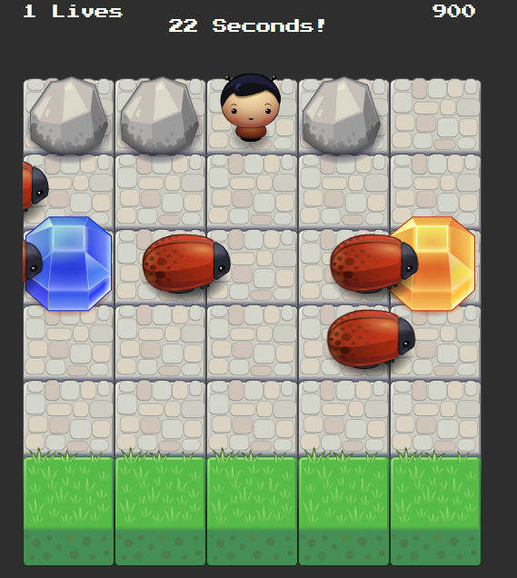
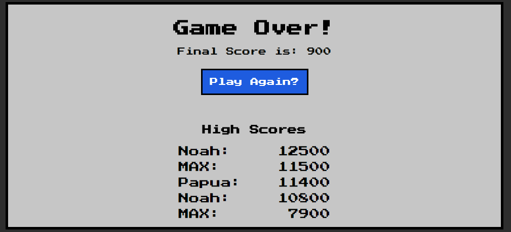

# BUGS -N- GEMS GAME
### By Carlos Fins 

Grab the gems. Avoid the bugs. Profit!

Play it here! [Bugs -N- Gems](https://clockwerkz.github.io/frontend-nanodegree-arcade-game/)

##How to Insall the Game Locally
Simply click on the green "Clone or Download" button above to download a local copy of the game in order to play. Once downloaded or installed, simply open the index.html file in a web browser to play. Alternatively, the game can be played on the live version: [Bugs -N- Gems](https://clockwerkz.github.io/frontend-nanodegree-arcade-game/).

## How To Play
The object of the game is to collect as many gems as possible in each level and escape out the top of the level before the time expires. Avoid the bugs! Everytime a player is hit by a bug, they lose one life and reset back to the bottom. *If the timer runs out, or the player loses all 3 lives, the game is over!* A local High Score tracker keeps track of players best achievements. Try and get the best possible score!

## Game Design

*The player selection screen when the game first starts*

I incorporated a timer into the game in order to create a new challenge for the player: exit the level before the time runs out or the game ends. In order to have levels that incrementally get harder, I create a gameModel object that is an array of objects with various properties and values to use in the game controller. For example, numberOfEnemies controls how many bugs will spawn, gemTiming controls the time between gem spawning, etc. As the levels progress, I also introduced rocks to hinder the player's escape. 

*Screen grab of the gameplay*

As I worked through the project, I kept a TODO list and a Wishlist of systems and ideas I wanted to implement.  That page is viewable here:
[TODO List](TODO.md)

*High Scores displayed at the end of the game*

Finally, I brought an idea I wanted to implement in my memory game in for this project: using localStorage to keep track of high scores.

## Dependencies
There aren't any direct dependencies. The Engine.js and Resource.js files were provided by Udacity for the project. There are no external libraries or resources used.

## Contributions 
As per the assignment rules, I was the only person working on this project. All code was written by myself; I did not copy/paste any code beyond using the starter files provided by the assignment.

## Licensing

This project is licensed under the Creative Commons Licensing. You are free to:

* Share - copy and redistribute the matertial in any medium or format

* Adapt - remix, transform, and build upon the material for any purpose, even commercially. 
